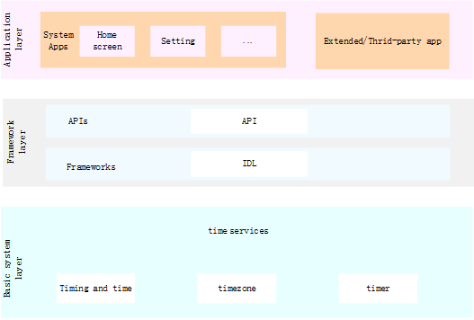

# Timing and Time<a name="EN-US_TOPIC_0000001115554184"></a>

-   [Introduction](#section11660541593)
-   [Directory Structure](#section161941989596)
-   [Usage](#section38521239153117)
    -   [Available JS APIs](#section11908203714422)
    -   [Sample Code](#section9938411124317)

-   [Repositories Involved](#section1371113476307)

## Introduction<a name="section11660541593"></a>

The timing and time module provides APIs for managing the system time.

**Figure  1**  Subsystem architecture<a name="fig143011012341"></a>  


## Directory Structure<a name="section161941989596"></a>

```
/base/miscservices/time
├── etc                      # Process configuration files
├── figures                  # Architecture diagram
├── interfaces               # APIs for external systems and applications
│   └── kits                # APIs
├── profile                  # System service configuration files
└── services                 # Service implementation
```

## Usage<a name="section38521239153117"></a>

### Available JS APIs<a name="section11908203714422"></a>

**Table  1**  Major functions of systemTime

<a name="table033515471012"></a>
<table><thead align="left"><tr id="row143351854201012"><th class="cellrowborder" valign="top" width="50%" id="mcps1.2.3.1.1"><p id="p103351154121010"><a name="p103351154121010"></a><a name="p103351154121010"></a>Function</p>
</th>
<th class="cellrowborder" valign="top" width="50%" id="mcps1.2.3.1.2"><p id="p1033585416105"><a name="p1033585416105"></a><a name="p1033585416105"></a>Description</p>
</th>
</tr>
</thead>
<tbody><tr id="row204321219393"><td class="cellrowborder" valign="top" width="50%" headers="mcps1.2.3.1.1 "><p id="p1893413268144"><a name="p1893413268144"></a><a name="p1893413268144"></a>function setTime(time : number) : Promise&lt;boolean&gt;</p>
</td>
<td class="cellrowborder" valign="top" width="50%" headers="mcps1.2.3.1.2 "><p id="p18761104812149"><a name="p18761104812149"></a><a name="p18761104812149"></a>Sets the system time and uses a Promise to return the execution result.</p>
</td>
</tr>
<tr id="row13335054111018"><td class="cellrowborder" valign="top" width="50%" headers="mcps1.2.3.1.1 "><p id="p12832214151418"><a name="p12832214151418"></a><a name="p12832214151418"></a>function setTime(time : number, callback : AsyncCallback&lt;boolean&gt;) : void</p>
</td>
<td class="cellrowborder" valign="top" width="50%" headers="mcps1.2.3.1.2 "><p id="p3335145451011"><a name="p3335145451011"></a><a name="p3335145451011"></a>Sets the system time and uses a callback to return the execution result.</p>
</td>
</tr>
</tbody>
</table>

### Sample Code<a name="section9938411124317"></a>

Example fo using systemTime

```
// Import the module.
import systemTime from '@ohos.systemTime';

// Set the system time asynchronously with a Promise.
var time = 1611081385000;
systemTime.setTime(time)
    .then((value) => {
        console.log(`success to systemTime.setTime: ${value}`);
    }).catch((err) => {
        console.error(`failed to systemTime.setTime because ${err.message}`);
    });

// Set the system time asynchronously with a callback.
var time = 1611081385000;
systemTime.setTime(time, (err, value) => {
    if (err) {
        console.error(`failed to systemTime.setTime because ${err.message}`);
        return;
    }
    console.log(`success to systemTime.setTime: ${value}`);
});
```

## Repositories Involved<a name="section1371113476307"></a>

**Misc services subsystem**

miscservices\_time

