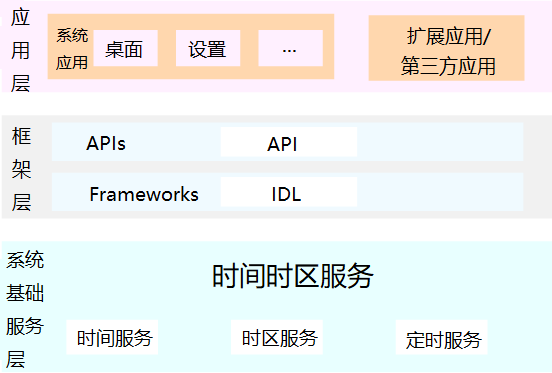

# 时间时区部件

## 简介

在整个OpenHarmony架构中提供管理系统时间时区和定时的能力，支持设置获取时间、日期、时区和系统定时器功能。

**图 1**  子系统架构图



## 目录

```
/base/time/time_service
├── etc                      # 组件包含的进程的配置文件
├── figures                  # 构架图
├── interfaces               # 组件对外提供的接口代码
│   └── innerkits            # 服务间接口
│   └── kits                 # 对应用提供的接口
├── profile                  # 组件包含的系统服务的配置文件
└── services                 # 时间服务实现
```

## 说明

### js接口说明


**表 1**  js组件systemTime开放的主要方法

| 接口名                                                       | 描述                                                 |
| ------------------------------------------------------------ | ---------------------------------------------------- |
| setTime(time : number) : Promise                             | 设置系统时间（1970-01-01至今毫秒数），Promise方式。  |
| setTime(time : number, callback : AsyncCallback<boolean>) : void | 设置系统时间（1970-01-01至今毫秒数），callback方式。 |
| setDate(date: Date, callback: AsyncCallback<boolean>): void; | 设置系统时间（Date格式），Promise方式。              |
| setDate(date: Date): Promise<boolean>                        | 设置系统时间（Date格式），callback方式。             |
| setTimezone(timezone: string, callback: AsyncCallback<boolean>): void | 设置系统时区，callback方式。                         |
| setTimezone(timezone: string): Promise<boolean>              | 设置系统时区，Promise方式。                          |

**表 2**  js组件systemTimer开放的主要方法

| 接口名                                                       | 描述                       |
| ------------------------------------------------------------ | -------------------------- |
| createTimer(options: TimerOptions, callback: AsyncCallback<number>): void | 创建定时器，callback方式。 |
| createTimer(options: TimerOptions): Promise<number>          | 创建定时器，promise方式。  |
| startTimer(timer: number, triggerTime: number, callback: AsyncCallback<boolean>): void | 开启定时器，callback方式。 |
| startTimer(timer: number, triggerTime: number): Promise<boolean> | 开启定时器，promise方式。  |
| stopTimer(timer: number, callback: AsyncCallback<boolean>):  void | 停止定时器，callback方式。 |
| stopTimer(timer: number): Promise<boolean>                   | 停止定时器，promise方式。  |
| destroyTimer(timer: number, callback: AsyncCallback<boolean>): void | 销毁定时器，callback方式。 |
| destroyTimer(timer: number): Promise<boolean>                | 摧毁定时器，promise方式。  |

**表 3**  systemTimer组件参数TimerOptions说明

| 名称      | 类型      | 说明                                                         |
| --------- | --------- | ------------------------------------------------------------ |
| type      | number    | 定时器类型。<br/>取值为1时，表示为系统启动时间定时器（定时器启动时间不能晚于当前设置的系统时间）；<br/>取值为2时，表示为唤醒定时器；<br/>取值为4时，表示为精准定时器；<br/>取值为5时，表示为IDLE模式定时器（暂不支持）。 |
| repeat    | boolean   | true 为循环定时器，false为单次定时器。                       |
| interval  | number    | 如果是循环定时器，repeat值应大于5000毫秒，非重复定时器置为0。 |
| wantAgent | wantAgent | 设置通知的wantagent，定时器到期后通知。                      |
| callback  | => void   | 设置回调函数，定时器到期后触发。                             |

### js接口使用说明

systemTime模块使用示例：

```javascript
// 导入模块
import systemTime from '@ohos.systemTime';

// Promise方式的异步方法设置时间   
var time = 1611081385000;   
systemTime.setTime(time).then((value) => {        
    console.log(`success to systemTime.setTime: ${value}`);   
}).catch((err) => {        
    console.error(`failed to systemTime.setTime because ${err.message}`)  
});

// callback方式的异步方法设置时间
var time = 1611081385000;   
systemTime.setTime(time, (err, value) => {   
    if (err) {        
        console.error(`failed to systemTime.setTime because ${err.message}`);   
        return;   
    }
    console.log(`success to systemTime.setTime: ${value}`);   
});
```

systemTimer模块使用示例：

```javascript
// 导入模块
import systemTimer from '@ohos.systemTimer';

console.log("start");
var options:TimerOptions{   
   type:TIMER_TYPE_REALTIME,   
   repeat:false,   
   interval:Number.MAX_VALUE/2,   
   persistent:false   
}

console.log("create timer")   
let timerId = systemTimer.Timer(options)     
console.log("start timer")   
let startTimerRes = systemTimer.startTimer(timerId, 100000)   
console.log("stop timer")   
let stopTimerRes = systemTimer.stopTimer(timerId)   
console.log("destroy timer")   
let destroyTimerRes = systemTimer.destroyTimer(timerId)   
console.log('end');   
```

## 相关仓

[Misc软件服务子系统](https://gitee.com/openharmony/docs/blob/master/zh-cn/readme/Misc软件服务子系统.md)

[**time\_time\_service**](https://gitee.com/openharmony/time_time_service/tree/master/)

